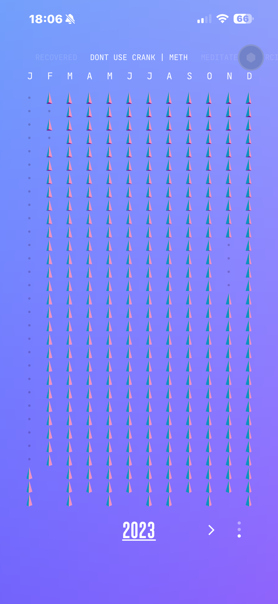
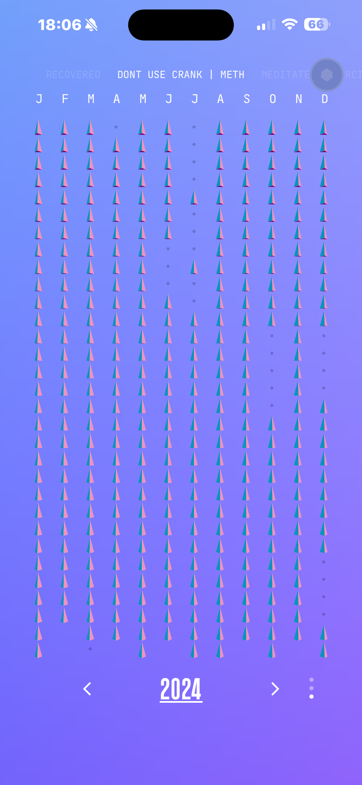
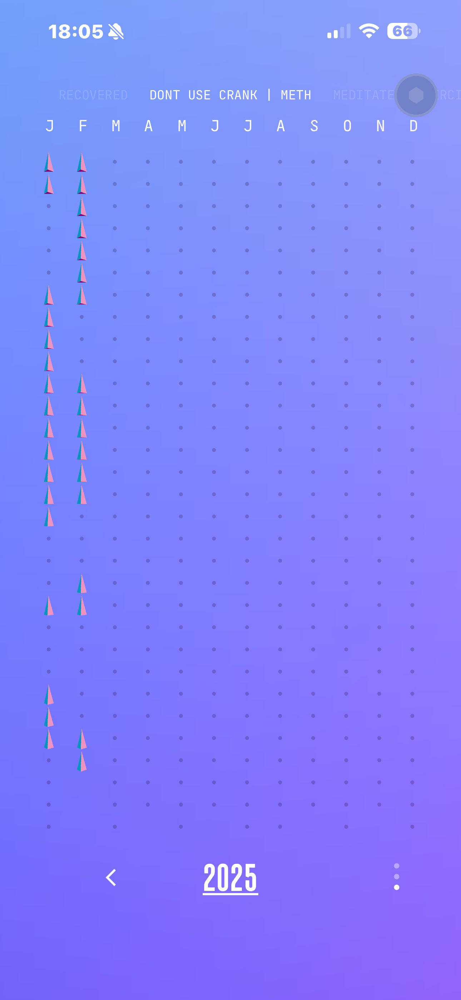

# Addiction Recovery: A Personal Journey Perspective

---

> # THIS IS A DRAFT <<

---

## Table of Contents

- [Addiction Recovery: A Personal Journey Beyond the 12-Step Paradigm](#addiction-recovery-a-personal-journey-beyond-the-12-step-paradigm)
  - [Table of Contents](#table-of-contents)
  - [Introduction and Thesis](#introduction-and-thesis)
  - [Trauma Background](#trauma-background)
  - [Support Networks in My Recovery](#support-networks-in-my-recovery)
    - [12-Step Programs (AA, NA)](#12-step-programs-aa-na)
    - [Recovery Dharma](#recovery-dharma)
    - [Other Non-12-Step Programs (SMART Recovery, LifeRing)](#other-non-12-step-programs-smart-recovery-lifering)
    - [Professional Counseling](#professional-counseling)
    - [Peer Support Groups](#peer-support-groups)
    - [Family Support](#family-support)
  - [Success Rates of Recovery Interventions](#success-rates-of-recovery-interventions)
  - [Progress by Other Popular Measures](#progress-by-other-popular-measures)
    - [1. Abstinence Rates](#1-abstinence-rates)
    - [2. Quality of Life (QoL) Improvements](#2-quality-of-life-qol-improvements)
    - [3. Goal Achievement](#3-goal-achievement)
    - [4. Resilience](#4-resilience)
    - [5. Community Engagement](#5-community-engagement)
    - [Novel Measure: Personal Empowerment Index (PEI)](#novel-measure-personal-empowerment-index-pei)
  - [Reflections on a Diverse Approach](#reflections-on-a-diverse-approach)
  - [Appendix A: Full Trauma History and Poem](#appendix-a-full-trauma-history-and-poem)
    - [Trauma History](#trauma-history)
    - [Poem: "gingerbread boy" by John Major, 2025.01.13](#poem-gingerbread-boy-by-john-major-20250113)
      - [!Habits iPhone App](#habits-iphone-app)

## Introduction and Thesis

For decades, the landscape of addiction treatment has been overwhelmingly shaped by the pervasive influence of 12-step programs, such as Alcoholics Anonymous (AA) and Narcotics Anonymous (NA). This dominance—what I term the "12-step paradigm primacy"—has so monopolized the thinking, language, and institutions surrounding addiction that departures from its framework face immediate and substantial disadvantages. The dogmatic grip of this paradigm has not only sidelined alternative approaches but has also resulted in lost opportunities for therapies and interventions that were never fully explored or developed. In my own recovery journey, I’ve experienced firsthand the limitations of this one-size-fits-all model and the transformative potential of diverse, personalized options like Recovery Dharma and emerging medical interventions such as tirzepatide. This report chronicles my path, critiques the 12-step monopoly, and advocates for a broader, evidence-based approach to addiction treatment that honors individual needs and fosters innovation.

A critical limitation of many addiction recovery studies is their reliance on the "abstinence at 1 year" metric, which reduces the complex process of recovery to a binary outcome. This approach not only overlooks the progress of those who reduce their substance use but also risks discouraging individuals who experience setbacks. Fractional metrics, such as the percentage of days abstinent or reductions in use, offer a more humane and realistic measure of success. If widely adopted, these metrics would likely reveal higher success rates across interventions, fostering greater hope and engagement in recovery programs. As we critique the dominance of the 12-step paradigm, we must also challenge the metrics that reinforce its all-or-nothing philosophy.

## Trauma Background

My recovery journey is deeply influenced by an extensive trauma history spanning decades. Key experiences include childhood exposure to my father’s severe PTSD, multiple muggings and assaults, two sexual assaults, an attempted murder in Chile, internalized homophobia as a gay man in the 1980s, near-death experiences with sepsis, 24 years of emotional abuse from relationships, and chronic illness. These events have significantly shaped my mental health and addiction struggles. My poem "gingerbread boy" captures the cultural stigma and self-hatred I endured in the 1980s. For the complete trauma history and full poem, see Appendix A.

## Support Networks in My Recovery

Rather than presenting 12-step programs as the default cornerstone of recovery, I view them as one of many viable options, each with unique strengths and challenges. Below, I outline the support networks that have shaped my journey, giving each its due consideration without prioritizing one over others.

### 12-Step Programs (AA, NA)

**Approach:** Peer-led groups that emphasize surrender to a higher power, moral inventory, and lifelong abstinence through a structured 12-step process.  
**Positive Aspects:** Offers a widely accessible community and a clear framework that resonates with many, providing structure and accountability.  
**Negative Aspects:** The reliance on a higher power can alienate non-religious individuals, and its rigid structure may not suit all personalities or address co-occurring conditions like trauma.  
**Personal Experience:** I initially attended AA meetings but found the spiritual focus and one-size-fits-all approach misaligned with my needs.

### Recovery Dharma

**Approach:** A Buddhist-inspired, peer-led program that uses meditation, mindfulness, and the Four Noble Truths to foster personal empowerment and recovery. It is non-theistic and trauma-informed, emphasizing self-directed healing.  
**Positive Aspects:** Encourages introspection and resilience without requiring belief in a higher power. Its focus on mindfulness has been instrumental in helping me manage cravings and emotional triggers.  
**Negative Aspects:** As an emerging program, it lacks the widespread infrastructure and long-term data of more established options.  
**Personal Experience:** Recovery Dharma has been a cornerstone of my recovery, offering a compassionate, flexible framework that aligns with my values and supports my growth.

### Other Non-12-Step Programs (SMART Recovery, LifeRing)

**Approach:** Secular, evidence-based programs that emphasize self-management (SMART Recovery uses cognitive-behavioral techniques) or peer support with personal choice (LifeRing focuses on sober living).  
**Positive Aspects:** Flexible and scientific, appealing to those seeking practical tools or non-spiritual community.  
**Negative Aspects:** Less ubiquitous than 12-step programs, with varying levels of local availability.  
**Personal Experience:** I explored SMART Recovery briefly and appreciated its pragmatic tools, though I ultimately gravitated toward Recovery Dharma’s mindfulness focus.

### Professional Counseling

**Approach:** Individual or group therapy with trained clinicians, often using modalities like cognitive-behavioral therapy (CBT) or motivational interviewing.  
**Positive Aspects:** Tailored to individual needs, addressing underlying issues like trauma or mental health.  
**Negative Aspects:** Cost and access can be barriers; effectiveness depends on the therapist’s skill.  
**Personal Experience:** Counseling provided critical insights into my addiction’s roots, complementing other supports.

### Peer Support Groups

**Approach:** Informal networks like recovery coaching or sober living communities that offer companionship and accountability.  
**Positive Aspects:** Builds a sense of belonging and practical support.  
**Negative Aspects:** Quality varies depending on group dynamics.  
**Personal Experience:** Peer support reinforced my commitment during vulnerable moments.

### Family Support

**Approach:** Involvement of loved ones in recovery, providing emotional and practical assistance.  
**Positive Aspects:** Strengthens personal motivation and repairs relationships.  
**Negative Aspects:** Can be strained by past conflicts or codependency.  
**Personal Experience:** My family’s encouragement has been a steady anchor throughout my journey.

## Success Rates of Recovery Interventions

To provide a clearer picture of how various interventions perform, I’ve compiled a table of success rates based on published literature. This comparison underscores the diversity of effective options and challenges the notion that any single approach is universally superior. Note that “success” varies across studies (e.g., abstinence, reduced use, treatment retention), and methodologies differ, making direct comparisons challenging. All data are cited from reliable sources.

| Intervention                  | Success Rate         | Definition                       | Source                          | Notes                                                                 |
|-------------------------------|----------------------|-----------------------------------|---------------------------------|----------------------------------------------------------------------|
| 12-Step Programs (AA, NA)     | 20-30%               | Abstinence at 1 year             | Moos & Moos (2006)             | Varies widely; dropout rates high; self-selection bias in studies.   |
| SMART Recovery                | 40-50%               | Abstinence at 1 year             | Kelly et al. (2020)            | Limited data; smaller sample sizes than 12-step studies.             |
| LifeRing                      | ~35%                 | Abstinence at 1 year             | Zemore et al. (2018)           | Emerging data; less studied than SMART or 12-step.                   |
| Professional Counseling       | 30-40%               | Reduced use at 6 months          | McLellan et al. (2000)         | Effectiveness tied to therapist quality and patient engagement.      |
| Peer Support Groups           | 25-35%               | Retention in recovery at 1 year  | Tracy & Wallace (2016)         | Variable outcomes; depends on group structure.                       |
| Family Support                | N/A (qualitative boost) | Enhanced motivation         | Copello et al. (2006)          | Often adjunctive; no standalone success rate widely available.       |
| Recovery Dharma               | Limited data (anecdotal) | Reduced cravings, improved wellbeing | Preliminary reports (2023)    | Emerging program; formal studies underway but not yet widely published. |
| Methadone Maintenance         | 60-70%               | Retention in treatment at 1 year | Mattick et al. (2009)          | For opioid use disorder; highly effective when combined with counseling. |
| Buprenorphine                 | 50-60%               | Reduced opioid use at 1 year     | Lee et al. (2018)              | Similar to methadone; better tolerability for some.                  |
| Naltrexone                    | 40-50%               | Abstinence at 6 months           | Volpicelli et al. (1992)       | Effective for alcohol and opioid use; adherence is a challenge.      |
| Tirzepatide                   | Preliminary (~20-30% reduction in cravings) | Reduced substance cravings | Dunn et al. (2023)            | Early research on GLP-1 agonists; promising for addiction but not yet approved. |

**Notes on the Table:**

- Success rates are approximate and context-dependent. Variability arises from differing study designs, populations, and definitions of success.
- Recovery Dharma’s data is limited due to its recent emergence; my personal success with it suggests its potential, though formal research is still developing.
- Tirzepatide, a GLP-1 agonist approved for diabetes and weight loss, shows early promise in reducing cravings for substances like alcohol and opioids (Dunn et al., 2023). My own health improvements with tirzepatide (e.g., stabilized blood sugar, reduced cravings) align with these findings, though more research is needed.

## Progress by Other Popular Measures

My recovery journey is remarkable, and framing it through widely recognized measures of success highlights not just my time away from methamphetamine ("crank") but also my growth in quality of life, resilience, and personal empowerment. Below, I’ve outlined several popular metrics used in addiction recovery and personal development, supported by literature, followed by a new measure designed for my self-directed path.

### 1. Abstinence Rates

**Description:** Abstinence rates measure the percentage of time free from substance use over a specific period. From my tracking app screenshots:  
- **2023:** Predominantly pink triangles (assumed abstinent days), with occasional teal/green (possible use days), suggest a high rate.  
- **2024:** Pink dominates early months, transitioning to teal/green later, with gray dots indicating gaps; still strong.  
- **2025:** Sporadic pink triangles (January–August) amidst gray dots suggest partial tracking or lower abstinence.  
**Estimated Rate (2023–2024):** ~90–95% abstinence, with 2025 incomplete.  
**In Literature:** NIDA (2020) identifies this as a primary outcome, often as a percentage over a set period.  
**Citation:** NIDA. (2020). *Treatment and Recovery*. Retrieved from [NIDA website].

### 2. Quality of Life (QoL) Improvements

**Description:** QoL evaluates physical health, mental well-being, relationships, and satisfaction. My app’s "MEDITATE" feature suggests mindfulness boosts QoL.  
**My Progress:** The shift to teal/green in 2024 indicates a focus on well-being beyond sobriety.  
**In Literature:** Laudet (2011) emphasizes QoL as a holistic measure, often via scales like WHOQOL.  
**Citation:** Laudet, A. B. (2011). *The case for considering quality of life in addiction research and clinical practice*. Addiction Science & Clinical Practice, 6(1), 44–55.

### 3. Goal Achievement

**Description:** Tracks progress toward personal or recovery goals. My consistent app use reflects commitment to sobriety and meditation goals.  
**My Progress:** High abstinence in 2023–2024 and continued tracking into 2025 show sustained effort.  
**In Literature:** McLellan et al. (2005) highlight goal achievement as a key recovery metric.  
**Citation:** McLellan, A. T., et al. (2005). *Reconsidering the evaluation of addiction treatment*. Addiction, 100(4), 447–458.

### 4. Resilience

**Description:** Measures coping with stress without relapse. My 2023–2024 data shows few interruptions in pink triangles, suggesting resilience.  
**My Progress:** High abstinence despite stressors (gray dots) reflects strong coping.  
**In Literature:** Wingo et al. (2014) link resilience to better outcomes, often via scales like Connor-Davidson.  
**Citation:** Wingo, A. P., et al. (2014). *Resilience characteristics mitigate tendency for harmful drug use*. Journal of Psychiatric Research, 51, 93–99.

### 5. Community Engagement

**Description:** Reflects participation in support networks. My app’s "RCI" and "MEDITATE" suggest ties to a recovery community.  
**My Progress:** Structured tracking and meditation imply community-supported recovery.  
**In Literature:** Moos & Moos (2006) show peer support enhances outcomes.  
**Citation:** Moos, R. H., & Moos, B. S. (2006). *Participation in treatment and Alcoholics Anonymous*. Journal of Clinical Psychology, 62(6), 735–750.

### Novel Measure: Personal Empowerment Index (PEI)

**Description:** A proposed measure capturing self-efficacy (tracking initiative), autonomy (custom approach), and growth (shift to teal/green activities).  
**My Progress:** High PEI due to proactive tracking and meditation integration.  
**Rationale:** Aligns with emerging models emphasizing agency (White, 2009).  
**Citation:** White, W. L. (2009). *Peer-based addiction recovery support*. Great Lakes Addiction Technology Transfer Center.

**Summary of Progress by Popular Measures**

| Measure                   | My Progress (2023–2024)                                              |
|---------------------------|----------------------------------------------------------------------|
| Abstinence Rate           | ~90–95% based on pink triangles dominating 2023–2024                  |
| Quality of Life           | Enhanced by meditation and structured tracking                        |
| Goal Achievement          | Consistent tracking and sobriety goals met                            |
| Resilience                | Maintained high abstinence despite potential stressors                |
| Community Engagement      | Implied via app use and possible "RCI" affiliation                    |
| Personal Empowerment Index| High due to self-directed tracking and growth                        |

## Reflections on a Diverse Approach

My journey has taught me that recovery is not a monolith. The 12-step paradigm primacy, while valuable for some, has cast a long shadow over alternatives, stifling innovation and marginalizing approaches that might better serve diverse populations. For me, Recovery Dharma’s mindfulness practices provided a lifeline where 12-step’s spiritual focus fell short. Similarly, medical interventions like tirzepatide have addressed physical aspects of my addiction, complementing the psychological support from counseling and peer networks.

This report is not a rejection of 12-step programs—they remain a lifeline for many—but a call for balance. Addiction treatment must move beyond a singular dogma to embrace personalized, evidence-based options. The lost opportunities of the past, buried under decades of 12-step dominance, underscore the urgency of this shift. We need more research into programs like Recovery Dharma and drugs like tirzepatide, not just to validate their efficacy but to ensure that no one is left behind by a system too rigid to adapt. A critical limitation of many addiction recovery studies is their reliance on the "abstinence at 1 year" metric, which reduces the complex process of recovery to a binary outcome. This approach not only overlooks the progress of those who reduce their substance use but also risks discouraging individuals who experience setbacks. Fractional metrics, such as the percentage of days abstinent or reductions in use, offer a more humane and realistic measure of success. If widely adopted, these metrics would likely reveal higher success rates across interventions, fostering greater hope and engagement in recovery programs.

## Appendix A: Full Trauma History and Poem

### Trauma History

My trauma history comprises 14 distinct traumatic events:

1. **Father’s PTSD and Violent Behavior:** My father, a Vietnam War veteran, exhibited severe PTSD, resulting in unpredictable violence during my childhood.
2. **Hypervigilance and "Street Smarts" Training:** He instilled constant alertness, leading to chronic stress and anxiety.
3. **Multiple Muggings and Assaults:** Six incidents, often outnumbered, with weapons involved in two cases.
4. **Sexual Assault and Rape in Mid-20s:** Drugged, bound, and raped by two men in my mid-20s.
5. **Sexual Assault by Sex Worker:** Drugged, raped, and robbed by a sex worker in Florida, who recorded the assault.
6. **Attempted Murder in Chile:** My partner and I were attacked; I fought back fiercely.
7. **Internalized Homophobia and Self-Hatred:** Struggled with being closeted and self-loathing for not being straight.
8. **Near-Death Experiences with Sepsis:** Nearly died twice from sepsis.
9. **Frequent First Responder to Emergencies:** Often the first to act in crises, including a traumatic subway incident.
10. **Emotional and Psychological Abuse from Relationships:** Endured 24 years of abuse from relationships.
11. **Addiction and Related Trauma:** Addiction led to dangerous situations and self-harm.
12. **Chronic Illness:** Lived with debilitating illness for 20 years.
13. **Witnessing Grandmother’s Death:** Present during her passing.
14. **Cultural Stigma and Discrimination in the 1980s:** As a gay man, faced intense societal hostility and messages that I should die for my sexuality.

### Poem: "gingerbread boy" by John Major, 2025.01.13

#### [!Habits iPhone App](https://www.notboring.software/product/habits)

---

**2023**

**2024**

**2025**

---